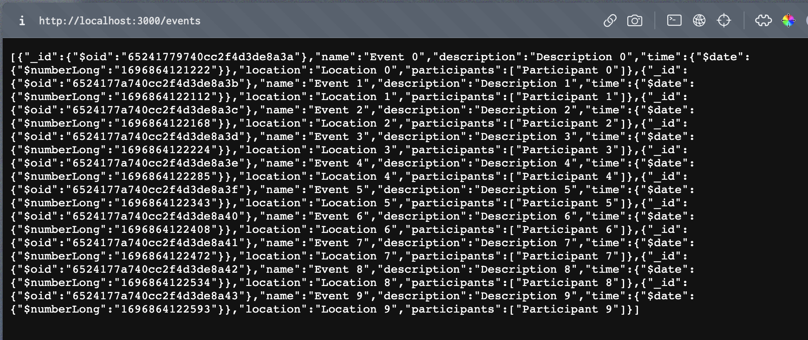
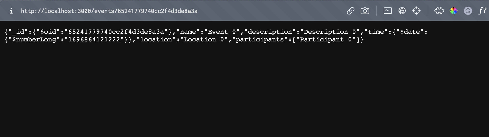

# Hack Technology / Project Attempted

Database-backed REST API with Rust and MongoDB

## What you built

Our team feels comfortable building APIs in JS/TS with Express,
but we thought it might be worth exploring other options,
especially more performant programming languages/frameworks like Go or Rust.

One of my teammates (Kevin Lin) mentioned that he built a Go API for hack-a-thing-1,
so I decided to have a go (pun intended) at building a Rust API for this hack-a-thing 2.

### Screenshots

#### Get All Events

#### Get Event by ID

## Who Did What?

Amittai worked on all parts of the project.

## What you learned

Experimenting with Rust was a lot of fun.  
Learning the mechanics of a new language with some interesting memory-management
mechanics that forego garbage collection.

Downside: I got lost down a rabbit-hole of how Rust works for the better part of half-a-day,
instead of actually working on the project.
But afterward everything else was pretty smooth sailing.

I think the Rust programming language itself, while really cool,
could be the biggest barrier to entry for basing our project in this direction
since it has a pretty steep learning curve and you cannot get away with
bad programming practices like you can in JS/TS.

Overall, though, the API was noticeably faster than the JS/TS APIs I've built in the past,
even when (I reckon) the bottleneck in both was probably the time taken to ping the
MongoDB database and get a response.

## Authors

Amittai

## Acknowledgments

- Rust documentatio at [crates.io](https://crates.io/)
- Rust MongoDB documentation at [docs.rs](https://docs.rs/mongodb/2.0.0/mongodb/)
- Official MongoDB Rust driver documentation at [mongofb](https://www.mongodb.com/docs/drivers/rust)
